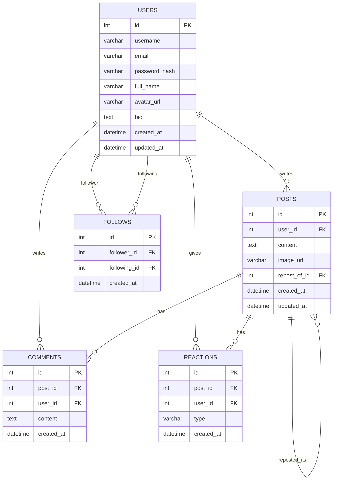

# Database Plan (MySQL)

## ER Diagram (Mermaid)

## Tables

### users
| Column | Type | Constraints |
|---|---|---|
| id | INT AUTO_INCREMENT | PK |
| username | VARCHAR(50) | UNIQUE, NOT NULL |
| email | VARCHAR(120) | UNIQUE, NOT NULL |
| password_hash | VARCHAR(255) | NOT NULL |
| full_name | VARCHAR(120) | NULL |
| avatar_url | VARCHAR(255) | NULL |
| bio | TEXT | NULL |
| created_at | DATETIME | DEFAULT NOW() |
| updated_at | DATETIME | ON UPDATE NOW() |

Indexes: `idx_users_username` (unique), `idx_users_email` (unique)

### posts
| Column | Type | Constraints |
|---|---|---|
| id | INT AUTO_INCREMENT | PK |
| user_id | INT | FK -> users.id, NOT NULL |
| content | TEXT | NOT NULL (can be empty string for pure reposts) |
| image_url | VARCHAR(255) | NULL |
| repost_of_id | INT | FK -> posts.id, NULL (set when this row is a repost) |
| created_at | DATETIME | DEFAULT NOW() |
| updated_at | DATETIME | ON UPDATE NOW() |

Indexes: `idx_posts_user_id`, `idx_posts_created_at` (for timeline sort), `idx_posts_repost_of_id`

### comments
| Column | Type | Constraints |
|---|---|---|
| id | INT AUTO_INCREMENT | PK |
| post_id | INT | FK -> posts.id, NOT NULL |
| user_id | INT | FK -> users.id, NOT NULL |
| content | VARCHAR(1000) | NOT NULL |
| created_at | DATETIME | DEFAULT NOW() |

Indexes: `idx_comments_post_id`

### reactions
| Column | Type | Constraints |
|---|---|---|
| id | INT AUTO_INCREMENT | PK |
| post_id | INT | FK -> posts.id, NOT NULL |
| user_id | INT | FK -> users.id, NOT NULL |
| type | ENUM('like','love','haha','wow','sad','angry') | DEFAULT 'like' |
| created_at | DATETIME | DEFAULT NOW() |

Constraints: UNIQUE(post_id, user_id) — one reaction per user per post (changing the type just updates the row)

### follows
(For a "following"-based timeline. MVP feed defaults to global, but the table/endpoints exist so switching is a one-line change.)

| Column | Type | Constraints |
|---|---|---|
| id | INT AUTO_INCREMENT | PK |
| follower_id | INT | FK -> users.id |
| following_id | INT | FK -> users.id |
| created_at | DATETIME | DEFAULT NOW() |

Constraints: UNIQUE(follower_id, following_id)

## Notes
- **Repost** = a new row in `posts` with `repost_of_id` pointing to the original post. `content` holds the optional caption the reposting user adds (can be blank for a "plain" repost).
- Deleting the original post: reposts keep existing (`ON DELETE SET NULL` on `repost_of_id`); the UI shows "original post unavailable" instead of crashing.
- All timestamps are UTC; convert to local time in the frontend.
